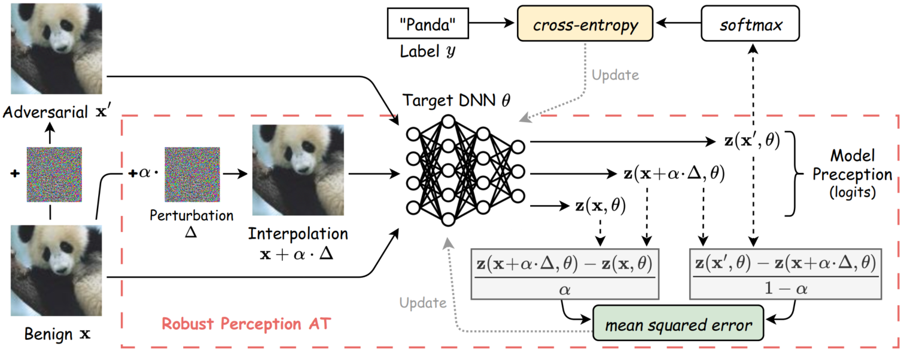

# *R*obust *P*erception *A*dversarial *T*raining (RPAT)

- The paper has been accepted for publication at 2025 International Conference on Computer Vision (ICCV'25).

- Our code is divided into two individual parts, namely *RPAT_Benchmarks* and *RPAT_SOTAs*. The latter corresponds to the results in Sec 5.3 of our paper, while other results are acquired through the former.

- The implementation of *RPAT_Benchmarks* is based on https://github.com/alinlab/consistency-adversarial, while *RPAT_SOTAs* is built upon https://github.com/PKU-ML/ReBAT. Our great thanks for the generous open-source!

## Core Idea

Adversarial Training (AT) creates an inherent trade-off between clean accuracy and adversarial robustness, which is commonly attributed to the more complicated decision boundary caused by the insufficient learning of hard adversarial samples. In this work, we reveal a counterintuitive fact for the first time: _**From the perspective of perception consistency, hard adversarial samples that can still attack the robust model after AT are already learned better than those successfully defended.**_ Thus, different from previous views, we argue that it is rather the over-sufficient learning of hard adversarial samples that degrades the decision boundary and contributes to the trade-off problem. Specifically, the excessive pursuit of perception consistency would force the model to view the perturbations as noise and ignore the information within them, which should have been utilized to induce a smoother perception transition towards the decision boundary to support its establishment to an appropriate location. In response, we define a new AT objective named _Robust Perception_, encouraging the model perception to change smoothly with input perturbations, based on which we propose a novel **_R_**obust **_P_**erception **_A_**dversarial **_T_**raining (**RPAT**) method, effectively mitigating the current accuracy-robustness trade-off. Experiments on CIFAR-10, CIFAR-100, and Tiny-ImageNet with ResNet-18, PreActResNet-18, and WideResNet-34-10 demonstrate the effectiveness of our method beyond four common baselines and 12 state-of-the-art (SOTA) works.




## 1. Dependencies

The two parts of code share the same environment, which can be reproduced via:

```
conda env create -f RPAT.yaml
```

## 2. For "RPAT_Benchmarks"

```
# Example for training with PGD-AT + RPAT
python train.py --mode adv_train --RA --model {model} --distance {norm} --epsilon {epsilon} --alpha {alpha} --epochs {epochs} --dataset {dataset}

# Example for training with Consistency-AT + RPAT
python train.py --mode adv_train --consistency --RA --model {model} --distance {norm} --epsilon {epsilon} --alpha {alpha} --epochs {epochs} --dataset {dataset}

# Example for evaluation with Auto-Attack
python eval.py --mode test_auto_attack --model {model} --distance {norm} --epsilon {epsilon} --dataset {dataset} --load_path {record_path}
```

## 3. For "RPAT_SOTAs"

```
# Example for training and evaluation with RPAT++ (i.e., ReBAT + RPAT)
python train_cifar_ra.py --fname {fname} --model {model} --norm {norm} --epsilon {epsilon} --pgd-alpha {alpha} --epochs {epochs} --num-classes {class_num_of_dataset}
```
